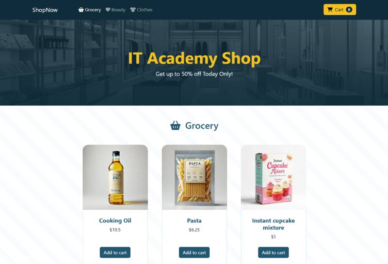

# S2.2. E-commerce

<p align="center">
  
</p>

## 📄 Descripción

Este repositorio implementa una tienda en línea utilizando **HTML**, **CSS**, **Bootstrap**, y **JavaScript**. Se enfoca en la creación de un diseño responsivo, la integración de funcionalidades interactivas y el uso de Sass para optimizar los estilos.

## ✨ Características

- **E-commerce Responsivo**: El diseño se adapta a diferentes tamaños de pantalla (escritorio, tablet y móvil) utilizando Bootstrap y media queries.
- **Carrito de Compras**: Implementación de la lógica para añadir, actualizar y eliminar productos del carrito, calculando el total y aplicando promociones dinámicamente.
- **Validación de Formularios**: Validación de los datos del formulario de checkout para garantizar la correcta introducción de información, como correo electrónico y contraseña.
- **Personalización con Bootstrap y Sass**: Uso de Bootstrap junto con Sass para personalizar colores y estilos, creando una interfaz moderna, atractiva y alineada con la identidad del proyecto.


## 💻 Tecnologías Utilizadas

- HTML5
- SCSS
- JavaScript
- Bootstrap 5

## 📋 Requisitos

- Node.js y npm instalados en tu sistema. Descárgalos desde nodejs.org.
- Navegador web compatible con HTML5 y CSS3.
- Editor de código, como Visual Studio Code (opcional).

## 🛠️ Instalación

**✔️ Paso 1:** Clona este repositorio:
```bash
git clone https://github.com/basantades/S2.2.-E-commerce.git
```

**✔️ Paso 2:** Ingresa al directorio del proyecto:
```bash
cd S2.2.-E-commerce
```

**✔️ Paso 3:** Instala las dependencias del proyecto (opcional, si estás utilizando herramientas adicionales como Bootstrap desde npm):
```bash
npm install
```

## ▶️ Ejecución

Abre el archivo **index.html** en tu navegador para visualizar la aplicación web. También puedes utilizar una extensión como Live Server en Visual Studio Code para iniciar un servidor local.

## 🤝 Contribuciones

Si deseas colaborar en este proyecto o informar sobre problemas, no dudes en crear un "issue" o enviar un "pull request."